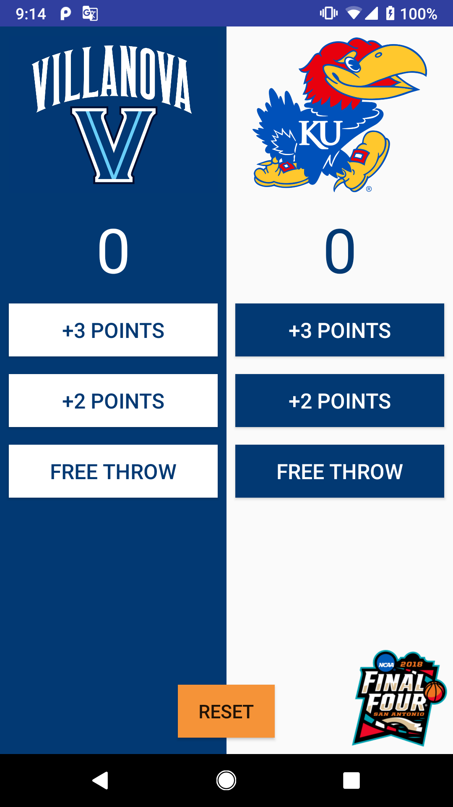

# ScoreKeeper
<b> A single screen app that keeps track of the score between two college basketball teams during the 2018 Final Four. </b> 

 Project #2 for the <b>Android Basics Nanodegree</b> by Google 

 This app focuses on user input. I learned the basics of object-oriented programming to make Android apps interactive. 
Each column contains a large TextView to keep track of the current score for that team. Each score button updates the score 
TextView in its column by adding the correct number of points. The reset button resets the scores on both of the score TextViews. 

Core Concepts I learned Completing this Project:
----------------------------------------------
-	Adding button code to apps
-	Updating views
-	Properly scoping variables
-	Finding views by their ID
-	Creating, positioning, and styling views
-	Creating interactivity through button clicks and Java code.

